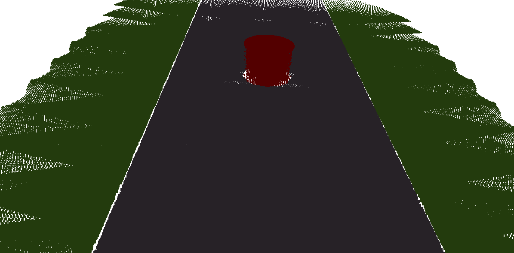
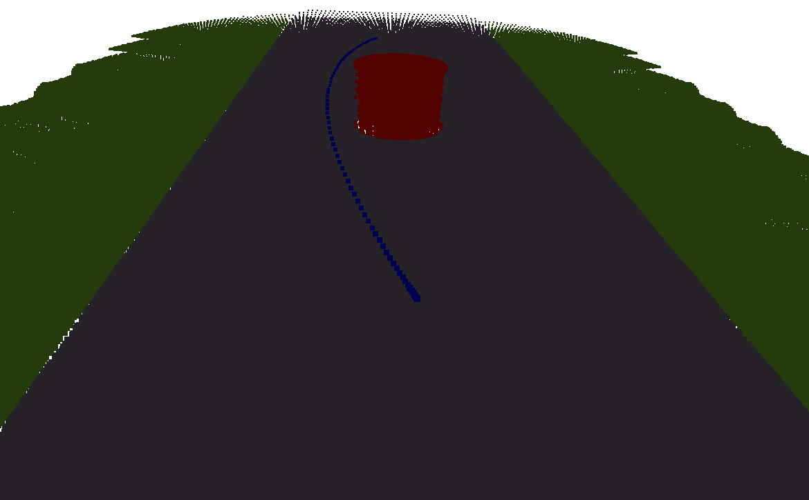
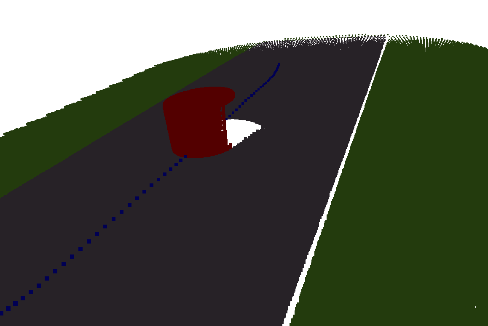

# Trajectory Optimization based Local Planner  
3D Voxels and Semantics-based continuous-time Motion planner for Autonomous Driving. Uses 3D point cloud and segmentation to create Voxels with semantic and TSDF information, and generates Euclidean Sign Distance Fields from TSDF which is later used to optimize a polynomial based trajectory optimization problem.    

## Simulated Scenes  
Currently, few simulated scenarios are provided to emulate basic on road obstacle scenarios.    
### Simple scenario
 A simple scenario of a single cylindrical obstacle in the road center.  
   
### Multi-Obstacle scenario  
A scenario consisting of two obstacles placed next to each other to evaluate planner turning betwen obstacles.  
   
### Sloped scenario  
Added a slope to the simple scenario to evaluate planner on uneven sloped surfaces.  
   
## Requirements  
The versions tested are specified in braces.  
- Eigen3 (3.3.7)  
- Protobuf (2.6.1)  
- Glog (0.4.0)  
- Ceres (1.14.0)  
- CMake (3.16.0)  
  
## Instructions - Manual Steps  
### Outline  
- Generate TSDF layers   
- Convert the TSDF layers  
- Visualize the ESDF layers   
- Planning using ESDF Map  
>**Note**    
>CMake Targets for the above specified programs are provided in the CMakeLists.txt  
  
### Steps  
#### TSDF Generation  
The pointcloud is generated by transforming the camera through the scene and incrementally integrating the point cloud and updating TSDF values for respective voxels.  
The TSDF layers are saved at the path specified as an argument for both obstacles and drivable zone.  
   
Usage: `generate_tsdf <scene> <output_obstacles_layer> <output_drivable_layer> <output_pointcloud>`  
   
**scene** Scenario for mapping. Choose from the scenarios mentioned in the last step. 
**output_obstacles_layer** Path to save the TSDF layer for driving zone  
**output_drivable_layer** Path to save the TSDF layer for obstacles  
**output_pointcloud** Path to save the colored point cloud as [XYZRGB]  in .txt file.
   
For example: `generate_tsdf tsdf_obstacles_layer.layer tsdf_free_layer.layer pointcloud.txt`  
   
#### ESDF Generation from TSDF  
Once we have a TSDF map for a scene, ESDF map can be generated from it and saved at the path provided. Along with the TSDF layer input, you need to specify   
the category of the ESDF map. i.e whether the maps is for obstacles or drivable zone. For obstacles the road surface is masked (using the pointcloud semantic label) to prevent it to be considered it as an obstacle.  
   
Usage: `esdf_from_tsdf <input_layer> <output_layer> <category>`  
   
**input_layer** Path to load the TSDF layer for driving zone  
**output_layer** Path to load the TSDF layer for obstacles  
**category** Path to load the TSDF layer for obstacles  
For example: `esdf_from_tsdf tsdf_obstacle_layer.layer esdf_obstacle_layer.layer obstacle`  
   
Here the `esdf_from_tsdf` is the generated executable.  
  
#### ESDF Voxel Visualization  
ESDF Voxels can be visualized as heat-map colored point cloud ranging colors from Red to Green indicating spectral variations in costs (not to be confused with the potential function which is calculated as squared and linear function of these values) for example for obstacles the Red areas are near obstacles or very near to obstacles, yellow near to obstacles and green is the free space and similarly following inverted color sequence for drivable free space in which case the road surface is color denoted as green while the area above or far from the road surface is indicated as yellow or red based on its distance from the road surface. practically, it ensures the path planned stays on the road surface and penalized the height from the road surface.  
   
Usage: `visualzie_esdf_voxels <input_layer_path> <layer_category>`    
Where <input_layer_path> is the path of TSDF layer generated in the last step and <layer_category> indicates the semantic category of the map. i.e obstacles or free space.  
   
For example to save ESDF map for obstacles use :    `visualzie_esdf_voxels esdf_free_layer.layer free` and  
similarly for drivable zone use : 
   
`visualzie_esdf_voxels esdf_obstacle_layer.layer obstacles`  
   
>**Note**    
>A colored pointcloud (XYZRGB) with voxel centers would be saved as layer_name_pointcloud.txt (e.g esdf_obstacles_layer_pointcloud.txt) .  
  
  
#### Planning  
After constructing ESDF maps for both obstacles and drivable space, we can use the distance information in the map to calculate potential fields indicating collision and road surface deviation costs and solve the optimization problem to find the trajectory polynomial minimizing these costs.  
  
## Scripts (For Linux)  
Below you can find scripts to build and perform all the steps define in the above manual steps.  
### Code compilation  
A script to compile the code using CMake is provided in scripts directory.  
`bash scripts/compile.sh`  
### Execution  
Scripts are also provided for each scenario to automate the complete process and save the results in output folder(contents described in the following section). The planned path (highlighted over scene) is saved as colored point cloud [XYZRGB format] in the output directory along with ESDF colored pointclouds for both obstacles and drivable zone .   
   
`bash scripts/simple-scenario.sh`  
`bash scripts/multi-scenario.sh`
`bash scripts/slope-scenario.sh`  
  
#### Output  
For each scenario, the following output files are generated.  
  
- output/pointcloud_scenario.txt where scenario can be [simple, multi, slope]  
	- Scene as colored pointcloud
- output/esdf_obstacles_layer_pointcloud.txt  
  - ESDF layer for obstacles saved as a colored heatmap  point cloud  
- output/esdf_free_layer_pointcloud.txt  
  - ESDF layer for drivable space saved as a colored heatmap  point cloud  
- output/pointcloud_scenario_plan.txt  
  - Planned path highlighted over the scene point cloud  
### Planner Details  
A document describing the planner equations and derivations can be found as  **planner.pdf** in the main directory.
  
## Results  
### Simple Scenario  
  
### Multi Scenario  
  
### Slope Scenario  
  
## Limitations  
### Planning directly through the center of obstacles  
  
  
   
**Fix (shown in below image)** Use multiple views from the camera to reduce blind spots particularly at the corners of obstacles which usually have empty ESDF Voxels because of obstacle blocking rays from the camera.  
Sometimes planner still goes through the obstacles as a compromise between smoothness costs and collision costs as it picks a colliding path over a non-smooth collision-free path as shown below.  
  
 
**Fix** The weight for smoothness costs can be further tweaked to find a suitable compromise between the costs to prioritize collision-free paths over smooth paths. Another more practical approach is to do local replanning along with using a global planner.
   
### Noise + Large unknown areas, holes in TSDF/ESDF maps 
The planner has difficulty planning through large holes and in unexplored areas specifically because the planner is conservative and all unknown space is considered an obstacle. The issue can be mitigated by having a certain limited region around the vehicle to be considered free so that the vehicle can start planning when having no initial knowledge of the surroundings.  
Another option can be to do an initial pass over the environment in an offline step to have an initial estimate of the map.

## Credits
The mapping is based on implementation from [Voxblox](https://github.com/ethz-asl/voxblox), particularly the mapping is extended to include semantic segmentation. The detailed algorithm for constructing ESDF values directly from TSDF values is discussed in the following paper.

Helen Oleynikova, Zachary Taylor, Marius Fehr, Juan Nieto, and Roland Siegwart, “**Voxblox: Incremental 3D Euclidean Signed Distance Fields for On-Board MAV Planning**”, in _IEEE/RSJ International Conference on Intelligent Robots and Systems (IROS)_, 2017.
 
 The planner is based on [Voxblox Planner](https://github.com/ethz-asl/mav_voxblox_planning) where it's extended to include semantic information for drivable space to constrain the planned path to valid on-road regions.
 
 Helen Oleynikova, Michael Burri, Zachary Taylor, Juan Nieto, Roland Siegwart, and Enric Galceran, “**Continuous-Time Trajectory Optimization for Online UAV Replanning**”. In _IEEE Int. Conf. on Intelligent Robots and Systems (IROS)_, October 2016.  
[[pdf](http://helenol.github.io/publications/iros_2016_replanning.pdf) | [bibtex](http://helenol.github.io/publications/iros_2016_replanning_bibtex.txt) | [video](https://www.youtube.com/watch?v=-cm-HkTI8vw)]
